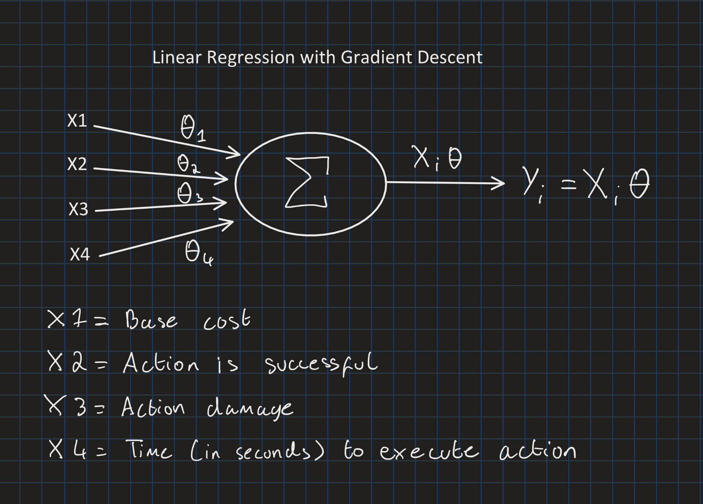

# Machine Learning

In the project, I used linear regression on the training dataset to be able to create the best theta. Below is an overview of the architecture of the implemented machine learning model.



The system takes 4 inputs while creating one output, the final (additional) cost. The inputs are tied to one action which allows for the data to be taken from the action after executing.

## Training Data

The application is able to track and store the relevant data needed to create an model, based off of multiple session of training. The data is stored in the ```/ProjectBoss/project-boss-ml-data.csv``` file. 

Inside ```Source/ProjectBoss/Boss/GOAP/GOAPAIController.cpp```, the GOAP sequences are tracked and stored until end of play, where the data is then parsed from the sequences and then saved to the file.

### User Participation
If the user has not enabled participation on the main menu, to track and store their data, then no new training data will be appended after a play session. If participation is enabled, then the enemy should learn and train to the player's style.
